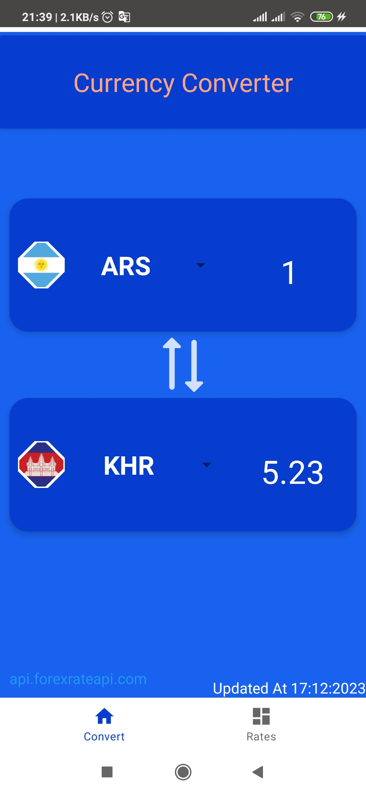
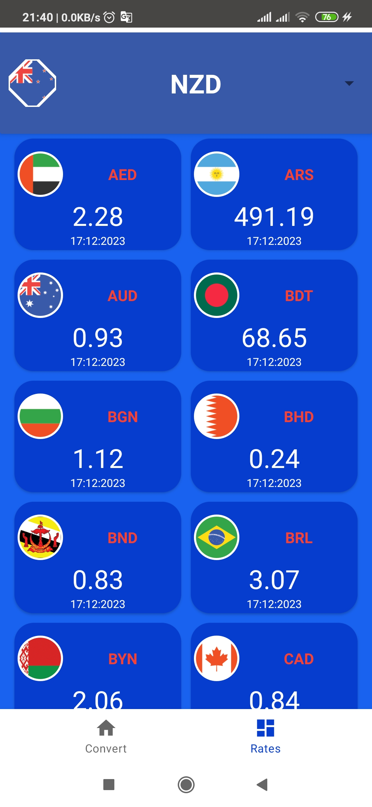

# Simple Currency Converter

This application is an android application for get and display currency exchange rates and it is implemented in MVVM Architecture pattern using kotlin.

## Features
User can do following:

-Display one currency price against another one.

-Display list of currency prices against base currency.

### Libraries
this application uses :

- Hilt for dependency injection.
- retrofit2 for making http requests.
- room library for store data locally.
- kotlin coroutines
- jetpack datasroe
- jetpack navigation components
- JUnit4 ,Espresso, hamcrest among other libraries for unit & instrumented tests.

### API keys

You need to supply API keys for the forexrateapi service the app uses.

- [forexrateapi](https://forexrateapi.com/)

Once you obtain the key, you can set them in your `~/gradle.properties`:

```
API_KEY= your key
```

### media



